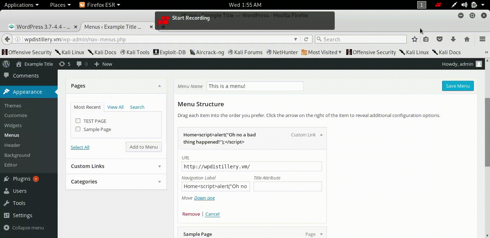

# codepath-week7
Week 7 submission for Codepath.

# Exploit 1: Authenticated Stored Cross-Site Scripting (XSS) in Youtube URL Embeds
XSS injection attack (Vulnerable from versions 4.0 – 4.7.2).

Reference: https://blog.sucuri.net/2017/03/stored-xss-in-wordpress-core.html 
 
This exploit targets a vulnerability in how WordPress handles video URLs related to YouTube videos, and is present in Core WordPress (the older version, that is). As noted in the reference, the user must be at least a contributor to exploit this vulnerability. 
 
Following the reference, I inserted this line into a post: `[embed src='https://youtube.com/embed/12345\x3csvg onload=alert(1)\x3e'][/embed]`

# Exploit 2: Nav Menu Title Cross-Site Scripting
XSS injection attack (Vulnerable from versions <=4.2.3).

Reference: https://core.trac.wordpress.org/changeset/33541 
 
The title of this vulnerability was self-explanatory to me. I looked up the source code to see what was changed (see reference) and saw that they erroneously used .html prior to fixing this vulnerability. This was a Core WP exploit. 
 
To fix this, I went to WordPress’s menus section and created a menu. I assigned it a page title, then I went to wpdistillery.vm. As the page loaded information, the alert message appeared.

# Exploit 3: Authenticated Shortcode Tags Cross-Site Scripting
XSS injection attack (Vulnerable from versions <=4.3).

Reference: https://wpvulndb.com/vulnerabilities/8186 
 
Using the reference, I added the provided payload into a page: `TEST!!![caption width="1" caption='<a href="' ">]</a><a href="http://onMouseOver='alert(1)'">Click me</a>`
 
I then saved and navigated to that page. When I simply hovered my mouse over the link (not even clicking it!), the alert() was successfully executed.

